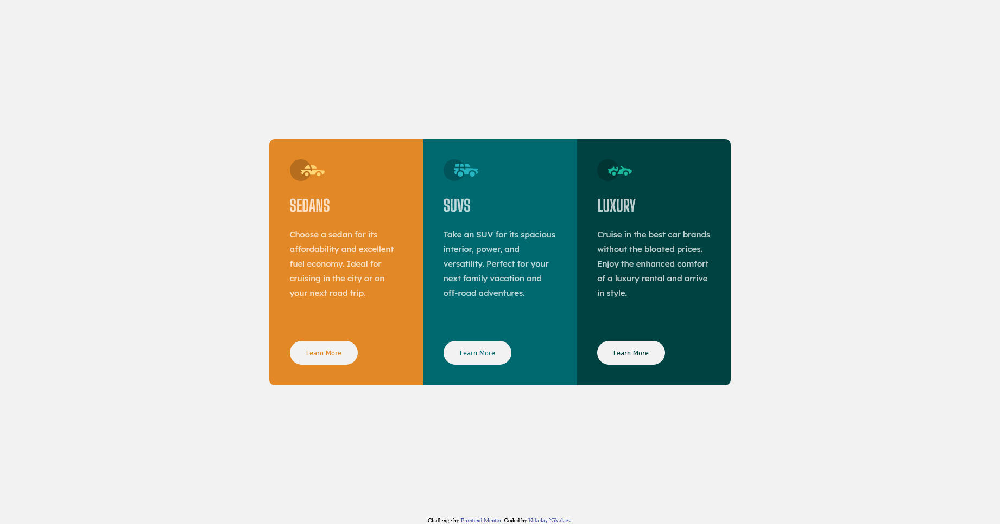

# Frontend Mentor - 3-column preview card component solution

This is a solution to the [3-column preview card component challenge on Frontend Mentor](https://www.frontendmentor.io/challenges/3column-preview-card-component-pH92eAR2-). Frontend Mentor challenges help you improve your coding skills by building realistic projects. 

## Table of contents

- [Overview](#overview)
  - [The challenge](#the-challenge)
  - [Screenshot](#screenshot)
  - [Links](#links)
- [My process](#my-process)
  - [Built with](#built-with)
  - [What I learned](#what-i-learned)
  - [Continued development](#continued-development)
  - [Useful resources](#useful-resources)
- [Author](#author)

**Note: Delete this note and update the table of contents based on what sections you keep.**

## Overview

### The challenge

Users should be able to:

- View the optimal layout depending on their device's screen size
- See hover states for interactive elements

### Screenshot

**Desktop View**



**Mobile View**


### Links

- Solution URL: [Github Repository](https://github.com/N-Nikolaev/FM--Newbie-2)
- Live Site URL: [Github Page](https://n-nikolaev.github.io/FM--Newbie-2)

## My process

### Built with

- Semantic HTML5 markup
- CSS custom properties
- CSS Grid
- Mobile-first workflow
- [SASS](https://sass-lang.com/) - CSS Preprocessor
- [Parcel](https://parceljs.org/) - Web Application Bundler


### What I learned

I learned that you can apply the border-radius property to a parent element and have it be visible through the children elements by hiding overflow. Sadly this solution didn't fit with my code and caused a bug to appear, but it is something interesting and something that I will be experimenting with in the future. 

```scss
// The solution to the border-radius on wrapping div problem
.wrapper {
  border-radius: 10px;

  overflow: hidden; // Clips off the corners on the children elements
}

// The alternative fix
@mixin mq {
  @media (min-width: $br--laptop) {
    @content;
  }
}

@mixin wrapRadius($radius) {
    &:first-child {
        border-radius: 0;
        border-top-left-radius: $radius;
        border-top-right-radius: $radius;

        @include mq {
            border-radius: 0;
            border-top-left-radius: $radius;
            border-bottom-left-radius: $radius;
        }
    }

    &:last-child {
        border-radius: 0;
        border-bottom-left-radius: $radius;
        border-bottom-right-radius: $radius;

        @include mq {
            border-radius: 0;
            border-top-right-radius: $radius;
            border-bottom-right-radius: $radius;
        }
    }
}

.wrapper { @include wrapRadius(10px); }
```


### Continued development

For the future, I plan to continue honing my Grid skills as I have done with this project.


### Useful resources

- [CSS: inner elements breaking border-radius](https://www.onenaught.com/posts/266/css-inner-elements-breaking-border-radius) - The overflow solution that I was quite enamoured with was found here. 


## Author

- Github - [Nikolay Nikolaev](https://github.com/N-Nikolaev)
- Frontend Mentor - [@N-Nikolaev](https://www.frontendmentor.io/profile/N-Nikolaev)
